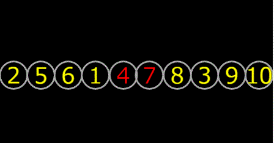

+++
date = "2019-06-16T20:55:06+09:00"
draft = false
slug = ""
tags = ["phina.js","algorithm"]
title = "【phina.js】バブルソートを視覚化してみた"
eyecatch = "bubble.gif"
+++

### バブルソートとは
プログラミングを習うと必ずと言って良いほど、最初に出てくるソートアルゴリズムです。
今回のコードは、**phina.js**でそれを視覚化してみたものです。
要素が入れ替わる様子が何となく分かるかと思います。

### 実行サンプル

<iframe src='https://runstant.com/alkn203/projects/eab92230/full' width='100%' height='640px' style='border:0px;box-shadow:0px 0px 2px 0px #aaa'></iframe>

### コード
[バブルソート視覚化(runstant)](https://runstant.com/alkn203/projects/eab92230)

### 参考にしたサイト
[バブルソート](https://www.codereading.com/algo_and_ds/algo/bubble_sort.html)