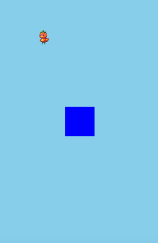

+++
date = "2019-08-17T20:55:06+09:00"
draft = true
slug = ""
tags = ["phina.js","tips","map"]
title = "【phina.js】マップデータの読み込みにおける工夫"
eyecatch = "mycollision.gif"
+++



### はじめに
ゲーム作りにおいてステージを作成する時、オブジェクトが少ない場合は１つ１つ位置を指定して追加していくこともできるでしょう。
でも、最終的には2次元配列でマップデータを作成して、プログラム内から読み込む方法などに落ち着くかと思います。

### 2次元配列のマップデータ
通常は、以下のようなデータを作成します。

```javascript
// ステージデータ
var STAGE = ['4','0','0','0','0','0','0','0','0','0'],
            ['4','0','0','0','0','0','0','0','0','0'],
            ['4','0','0','0','0','0','0','0','0','0'],
            ['4','0','0','0','0','0','0','0','0','0'],
            ['4','0','0','0','0','0','0','0','0','0']];
```

* 配列ですので、それぞれの要素をシングルクオーテーションで囲む必要があり、データの修正などが結構面倒です。

### マップデータを簡素化する
少し簡略化した以下の形式で読め込めるようにします。この形式だとコピーアンドペーストも楽です。

```javascript
// ステージデータ
var STAGE = ['4000000000'],
            ['4000000000'],
            ['4000000000'],
            ['4000000000'],
            ['4000000000']];
```

### マップデータ読み込み処理

