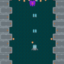

+++
date = "2019-07-03T20:55:06+09:00"
draft = false
slug = ""
tags = ["phina.js","tutorials","shooting"]
title = "【phina.js】2Dシューティングチュートリアル =第12回 エネミーのHP、弾の攻撃力、アニメーションの追加="
eyecatch = "playerblink.gif"
+++



### はじめに
[前回](/posts/tutorials/phina-shooting-11/)は、ゲームのタイトルを作って、ゲーム開始と終了を実装しました。今回は、ゲームを面白くする要素として「敵のヒットポイント」と「弾の攻撃力」そして「敵ががダメージを受けた時のエフェクト」と「プレイヤーの無敵エフェクト」を実装します。

### 敵のHPとプレイヤーの攻撃力の実装

**Enemy**クラスに敵のHPを実装します。

```javascript
/*
 * 敵クラス
 */
phina.define("Enemy", {
  // 継承
  superClass: 'SpaceShip',
  // 初期化
  init: function(param) {
    // 親クラス初期化
    this.superInit({ speed: 3 });
    // フレームアニメーション指定
    this.anim.gotoAndPlay('enemy');
    // 当たり判定用矩形
    this.collider = Collider({
      width: 40,
      height: 40,
    }).addChildTo(this);
    // ヒットポイント
    this.hp = (param && param.hp !== undefined) ? param.hp : 1;
```

敵のHPはコンストラクタからパラメータで指定できるようにします。   

次に、**PlayerBullet**クラスに弾の攻撃力を実装します。

```javascript
phina.define("PlayerBullet", {
  // 継
  superClass: 'Sprite',
  // 初期化
  init: function() {
    // 親クラス初期化
    this.superInit('bullet', 64, 64);
    // スピード
    var speed = 10;
    // 攻撃力
    this.power = 1;
```

### 敵のヒットポイントが0になった時に爆発させる 

- プレイヤーの弾と敵の当たり判定処理で、敵のヒットポイントを減らす処理を追加します。
- ヒットポイントが0になったら**Explosion**を生成します。

```javascript
// プレイヤーの弾と敵の当たり判定
hitTestBulletToEnemy: function() {
  var self = this;

  playerBulletGroup.children.each(function(bullet) {
    self.waveGroup.children.each(function(enemy) {
      // 当たり判定用の矩形
      var r1 = bullet.collider.getAbsoluteRect();
      var r2 = enemy.collider.getAbsoluteRect();
      // ヒットなら
      if (Collision.testRectRect(r1, r2)) {
        // 敵のHPを減らす
        enemy.hp -= bullet.power;
        // 弾削除
        bullet.remove();
        // HPチェック
        if (enemy.hp <= 0) {
          // 爆発表示
          Explosion().addChildTo(self).setPosition(enemy.x, enemy.y);
          // 敵削除
          enemy.remove();
        }
      }
    });
  });
},
```

### ダメージを受けた時の表現

- 敵がダメージを受けたときに、わかりやすく機体の色を赤色にします。
- ピクセル単位で画像の色を変えることも可能ですが、**canvas**のクロスオリジン問題に引っかかるため、今回はマスクをかける方法にします。
- マスク処理については、[この記事](https://qiita.com/simiraaaa/items/2a1cc7b0f92718d6eed6)のマスク処理関数をそのまま利用します。

```javascript
// シップの画像に赤い半透明マスク処理をした新たな画像をアセットに追加
maskImage('spaceship', 'rgba(255, 0, 0, 0.3)', 'redship');
```

追加したアセットを使用して、敵の画像を赤く処理したスプライトのクラスを作成します。

```javascript
/*
 * ダメージ敵クラス
 */
phina.define("DamagedEnemy", {
  // 継承
  superClass: 'Sprite',
  // 初期化
  init: function() {
    // 親クラス初期化
    this.superInit('redship', 64, 64);
    // 敵のフレームインデックス
    this.frameIndex = 4;
  },
}); 
```

- 敵がプレイヤーの弾に被弾したときに、赤い敵のスプライトを画像を重ねて表示します。
- **tweener**で一定時間後に削除するようにします。

```javascript
// 赤色表示
var damage = DamagedEnemy().addChildTo(enemy);
damage.tweener.clear()
              .wait(100)
              .call(function() {
                damage.remove();
              });         
```

### プレイヤーの無敵エフェクト

ゲーム開始後、一定時間プレイヤーを点滅させて無敵状態にします。

##### 複数のtweenerの並行処理
実現方法として、以下の３つの**tweener**を並行処理させます。

- 弾を発射し続ける**shotTween**
- プレイヤーを点滅させる**blinkTween**
- 点滅時間を管理する**timerTween**

```javascript
// 一定間隔で弾を発射
    var shotTween = Tweener().clear()
                             .call(function() {
                               this.shot();
                             }, this)
                             .wait(shotDelay)
                             .setLoop(true);
```

これまでと違う点は、**Tweener**クラスから作成するように変更しているところです。

```javascript
// 点滅
    this.blinkTween = Tweener().clear().fadeOut(100).fadeIn(100).setLoop(true);
    // 点滅時間管理用
    var timerTween = Tweener().clear()
                              .wait(5000)
                              .call(function() {
                                this.alpha = 1.0;
                                this.blinkTween.stop();
                              }, this);
```

- **blinkTween**は、単に一定時間で透明化・非透明化を繰り返しているだけです。
- **timerTween**は、5秒後に**blinkTween**をストップする役割を持っています。

```javascript
// Tweener並列適用
this.blinkTween.attachTo(this);
shotTween.attachTo(this);
timerTween.attachTo(this);
```

作成した**tweener**をプレイヤーにアタッチすることで、各々が並行で処理されます。

##### 当たり判定での処理

```javascript
// 敵の弾とプレイヤーの当たり判定
hitTestBulletToPlayer: function() {
  var self = this;
  
  if (this.playerGroup.children.length > 0) {
    var tween = this.playerGroup.children.first.blinkTween;
    // プレイヤーが無敵状態なら判定しない
    if (tween && tween.playing) return;
  }
```

敵の弾とプレイヤーの当たり判定処理の中で**blinkTween**を参照して、**tweener**が動いている間は、無敵状態として扱い当たり判定をスキップしています。

### 実行サンプル

[実行サンプル(runstant)](https://runstant.com/alkn203/projects/41bb1cb1)
