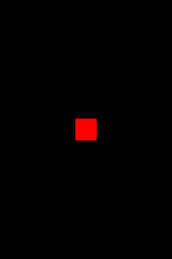

+++
date = "2021-06-24T14:59:06+09:00"
draft = false
slug = ""
tags = ["event"]
title = "独自のイベントを登録・発行する"
eyecatch = "original-event.png"
+++



## 独自イベントの登録
Shapeに対して独自のイベントを登録・発行する方法についてします。

## on + イベント名
* オブジェクトに独自イベントを登録するためには、**on + イベント名** の関数をオブジェクトに実装します。
* 今回はイベント名を**hit**としたいので**onhit**としました。

```js
// hitイベント登録
shape.onhit = function() {
  alert('Hit!');  
};
```

### 独自イベント発行
イベントの発行は、flare(イベント名)で行います。


```js
// タッチイベント登録
shape.onpointstart = function() {
  // hitイベント発行
  shape.flare('hit');
};
```

## サンプルコード
<details>
<summary>コードを見る</summary>

```js
// グローバルに展開
phina.globalize();
/*
 * メインシーン
 */
phina.define("MainScene", {
  // 継承
  superClass: 'DisplayScene',
  // 初期化
  init: function() {
    // 親クラス初期化
    this.superInit();
    // 背景色
    this.backgroundColor = 'black';
    // Shapeを作成してシーンに追加・位置指定
    var shape = Shape().addChildTo(this).setPosition(320, 480);
    // 背景色設定
    shape.backgroundColor = 'red';
    // タッチ可能にする
    shape.setInteractive(true);
    // タッチイベント登録
    shape.onpointstart = function() {
      // hitイベント発行
      shape.flare('hit');
    };
    // hitイベント登録
    shape.onhit = function() {
      alert('Hit!');  
    };
  },
});
/*
 * メイン処理
 */
phina.main(function() {
  // アプリケーションを生成
  var app = GameApp({
    // MainScene から開始
    startLabel: 'main',
  });
  // fps表示
  //app.enableStats();
  // 実行
  app.run();
});
```

</details>

## runstantプロジェクト
https://runstant.com/alkn203/projects/c57dbef8