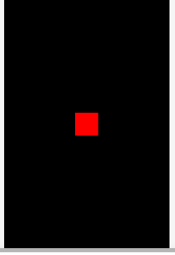

+++
date = "2021-06-24T17:59:06+09:00"
draft = false
slug = ""
tags = ["event"]
title = "特定の種類のイベントを全て削除する"
eyecatch = "remove-event-all.gif"
+++



## clear メソッド
特定のイベントの登録を全て削除するには、以下のように**clear**を使います。

```js
shape.clear('enterframe');
});
```

以下の例では、**enterframe** イベントを2つ登録しており、タッチするとそれが削除されるようにしています。結果として、**shape** のサイズ拡大が止まります。

```js
// 更新イベント登録
shape.on('enterframe', function() {
  shape.width++;  
});
// 更新イベント更新登録
shape.on('enterframe', function() {
  shape.height++;  
});
// タッチイベント登録
shape.on('pointstart', function() {
  // 特定の種類のイベント登録を全て削除する
  shape.clear('enterframe');
});
```

## サンプルコード
<details>
<summary>コードを見る</summary>

```js
// グローバルに展開
phina.globalize();
/*
 * メインシーン
 */
phina.define("MainScene", {
  // 継承
  superClass: 'DisplayScene',
  // 初期化
  init: function() {
    // 親クラス初期化
    this.superInit();
    // 背景色
    this.backgroundColor = 'black';
    // Shapeを作成してシーンに追加・位置指定
    var shape = Shape().addChildTo(this).setPosition(320, 480);
    // 背景色設定
    shape.backgroundColor = 'red';
    // タッチ可能にする
    shape.setInteractive(true);
    // 更新イベント登録
    shape.on('enterframe', function() {
      shape.width++;  
    });
    // 更新イベント更新登録
    shape.on('enterframe', function() {
      shape.height++;  
    });
    // タッチイベント登録
    shape.on('pointstart', function() {
      // 特定の種類のイベント登録を全て削除する
      shape.clear('enterframe');
    });
  },
});
/*
 * メイン処理
 */
phina.main(function() {
  // アプリケーションを生成
  var app = GameApp({
    // MainScene から開始
    startLabel: 'main',
  });
  // fps表示
  //app.enableStats();
  // 実行
  app.run();
});
```

</details>

## runstantプロジェクト
https://runstant.com/alkn203/projects/d6d50d82