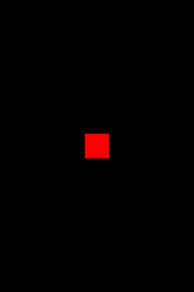

+++
date = "2021-06-24T15:59:06+09:00"
draft = false
slug = ""
tags = ["event"]
title = "登録したイベントを削除する"
eyecatch = "remove-event.png"
+++



## イベントの削除
イベントを削除するためには、**off** メソッドを使います。

```js
// タッチ関数
var touchFunc = function() {
    alert("タッチされました");
    // 2度と呼ばないよう解除する
    shape.off("pointstart", touchFunc);
};
// タッチ開始時に呼ばれる関数を登録
shape.on('pointstart', touchFunc);
};
```

* **off**では第2引数に関数を指定する必要があるため、 **touchFunc**として別に定義しています。
* 実行すると、タッチイベントが1回だけしか発生しないのが分かります。

## サンプルコード
<details>
<summary>コードを見る</summary>

```js
// グローバルに展開
phina.globalize();
/*
 * メインシーン
 */
phina.define("MainScene", {
  // 継承
  superClass: 'DisplayScene',
  // 初期化
  init: function() {
    // 親クラス初期化
    this.superInit();
    // 背景色
    this.backgroundColor = 'black';
    // Shapeを作成してシーンに追加・位置指定
    var shape = Shape().addChildTo(this).setPosition(320, 480);
    // 背景色設定
    shape.backgroundColor = 'red';
    // タッチ可能にする
    shape.setInteractive(true);
    // タッチ関数
  	var touchFunc = function() {
  	    alert("タッチされました");
  	    // 2度と呼ばないよう解除する
  	    shape.off("pointstart", touchFunc);
  	};
  	// タッチ開始時に呼ばれる関数を登録
    shape.on('pointstart', touchFunc);
  },
});
/*
 * メイン処理
 */
phina.main(function() {
  // アプリケーションを生成
  var app = GameApp({
    // MainScene から開始
    startLabel: 'main',
  });
  // fps表示
  //app.enableStats();
  // 実行
  app.run();
});
```

</details>

## runstantプロジェクト
https://runstant.com/alkn203/projects/8ce700ac