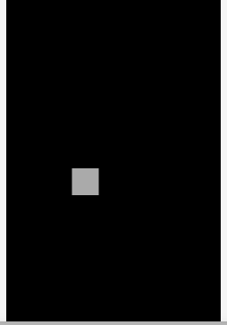

+++
date = "2021-06-24T12:59:06+09:00"
draft = false
slug = ""
tags = ["touch"]
title = "タッチされた座標を調べる"
eyecatch = "touch-point.gif"
+++



## タッチされた座標を調べる
* タッチされた座標を調べるためには、イベント関数の引数を利用します。
* **pointer**プロパティにタッチに関する情報が入っていますので、それを利用します。

```js
// シーンにタッチイベント登録
this.onpointstart = function(e) {
  // タッチされた座標を調べる
  var tx = e.pointer.x;
  var ty = e.pointer.y;
  // タッチされた座標にShapeを移動
  shape.setPosition(tx, ty);
};
```

## サンプルコード
<details>
<summary>コードを見る</summary>

```js
// グローバルに展開
phina.globalize();
/*
 * メインシーン
 */
phina.define("MainScene", {
  // 継承
  superClass: 'DisplayScene',
  // 初期化
  init: function() {
    // 親クラス初期化
    this.superInit();
    // 背景色
    this.backgroundColor = 'black';
    // Shapeを作成してシーンに追加
    var shape = Shape().addChildTo(this).setPosition(320, 480);
    // シーンにタッチイベント登録
    this.onpointstart = function(e) {
      // タッチされた座標を調べる
      var tx = e.pointer.x;
      var ty = e.pointer.y;
      // タッチされた座標にShapeを移動
      shape.setPosition(tx, ty);
    };
  },
});
/*
 * メイン処理
 */
phina.main(function() {
  // アプリケーションを生成
  var app = GameApp({
    // MainScene から開始
    startLabel: 'main',
  });
  // fps表示
  //app.enableStats();
  // 実行
  app.run();
});
```

</details>

## runstantプロジェクト
https://runstant.com/alkn203/projects/72f02607