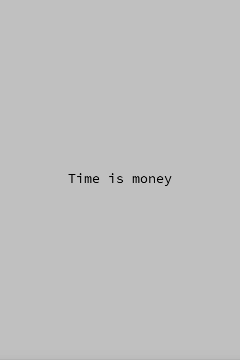

+++
date = "2021-06-22T10:59:06+09:00"
draft = false
slug = ""
tags = ["label"]
title = "Label(文字)を表示する"
eyecatch = "add-label.png"
+++



## Labelクラスを使ってラベル（文字）を表示する
文字を表示するためのラベルは、ゲーム作成には欠かせない存在です。以下は、ラベルを画面の中心に表示するコード例です。


```js
// ラベル表示
var label = Label('Time is money').addChildTo(this);
label.setPosition(this.gridX.center(), this.gridY.center());
```

* **Label**クラスのコンストラクタの引数に表示したい文字列を指定します。
* 単純に文字を表示したい場合に一番簡単な方法です。

## サンプルコード
<details>
<summary>コードを見る</summary>

```js
// グローバルに展開
phina.globalize();
/*
 * メインシーン
 */
phina.define("MainScene", {
  // 継承
  superClass: 'DisplayScene',
  // 初期化
  init: function() {
    // 親クラス初期化
    this.superInit();
    // 背景色
    this.backgroundColor = 'silver';
    // ラベル表示
    var label = Label('Time is money').addChildTo(this);
    label.setPosition(this.gridX.center(), this.gridY.center());
  },
});
/*
 * メイン処理
 */
phina.main(function() {
  // アプリケーションを生成
  var app = GameApp({
    // MainScene から開始
    startLabel: 'main',
  });
  // fps表示
  //app.enableStats();
  // 実行
  app.run();
});
```

</details>

## runstantプロジェクト
https://runstant.com/alkn203/projects/d23ea2d3