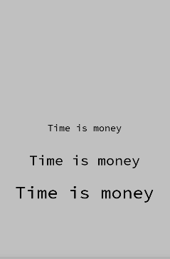

+++
date = "2021-06-22T11:01:06+09:00"
draft = false
slug = ""
tags = ["label"]
title = "Labelの文字サイズを変更する"
eyecatch = "change-label-size.png"
+++



## ラベルの文字サイズを変更する
ラベルの文字は、**fontSize** プロパティで後から変更可能です。

```js
var label2 = Label('Time is money').addChildTo(this);
label2.setPosition(320, 600);
label2.fontSize = 48;
var label3 = Label('Time is money').addChildTo(this);
label3.setPosition(320, 720);
label3.fontSize = 60;
```

## サンプルコード
<details>
<summary>コードを見る</summary>

```js
// グローバルに展開
phina.globalize();
/*
 * メインシーン
 */
phina.define("MainScene", {
  // 継承
  superClass: 'DisplayScene',
  // 初期化
  init: function() {
    // 親クラス初期化
    this.superInit();
    // 背景色
    this.backgroundColor = 'silver';
    // ラベル表示
    var label = Label('Time is money').addChildTo(this);
    label.setPosition(320, 480);
    var label2 = Label('Time is money').addChildTo(this);
    label2.setPosition(320, 600);
    label2.fontSize = 48;
    var label3 = Label('Time is money').addChildTo(this);
    label3.setPosition(320, 720);
    label3.fontSize = 60;
  },
});
/*
 * メイン処理
 */
phina.main(function() {
  // アプリケーションを生成
  var app = GameApp({
    // MainScene から開始
    startLabel: 'main',
  });
  // fps表示
  //app.enableStats();
  // 実行
  app.run();
});
```

</details>

## runstantプロジェクト
https://runstant.com/alkn203/projects/5235922d