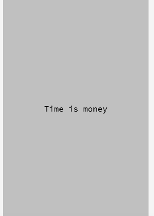

+++
date = "2021-06-22T11:00:06+09:00"
draft = false
slug = ""
tags = ["label"]
title = "Labelの文字を変更する"
eyecatch = "change-label-text.gif"
+++



## ラベルの文字を変更する
ラベルの文字は、**text** プロパティで後から変更可能です。
以下のサンプルでは、画面がタッチされたらラベルの文字を変更しています。


```js
// ラベル表示
var label = Label('Time is money').addChildTo(this);
label.setPosition(this.gridX.center(), this.gridY.center());
// ラベル文字変更
this.onpointstart = function() {
  label.text = 'Money is time';
};
```

## サンプルコード
<details>
<summary>コードを見る</summary>

```js
// グローバルに展開
phina.globalize();
/*
 * メインシーン
 */
phina.define("MainScene", {
  // 継承
  superClass: 'DisplayScene',
  // 初期化
  init: function() {
    // 親クラス初期化
    this.superInit();
    // 背景色
    this.backgroundColor = 'silver';
    // ラベル表示
    var label = Label('Time is money').addChildTo(this);
    label.setPosition(this.gridX.center(), this.gridY.center());
    // ラベル文字変更
    this.onpointstart = function() {
      label.text = 'Money is time';
    };
  },
});
/*
 * メイン処理
 */
phina.main(function() {
  // アプリケーションを生成
  var app = GameApp({
    // MainScene から開始
    startLabel: 'main',
  });
  // fps表示
  //app.enableStats();
  // 実行
  app.run();
});
```

</details>

## runstantプロジェクト
https://runstant.com/alkn203/projects/093751a0