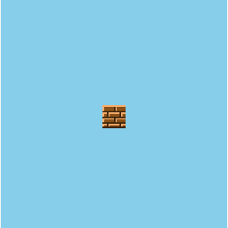

+++
date = "2019-09-18T20:55:06+09:00"
draft = false
slug = ""
tags = ["canvas"]
title = "【phina.js】マリオのようなブロック破壊処理"
eyecatch = "break.gif"
+++

### はじめに
子供の頃始めてスーパーマリオブラザーズをプレイした時、ブロックが壊せることが斬新で、必要のないところまで壊しまくったりしたものです。今回は、**phina.js**でその再現を試みてみました。



[サンプルコード(runstant)](https://runstant.com/alkn203/projects/d2add699)

### ブロックの動きを観察する
マリオのブロックの壊れ方を自分なりに観察してみましたが、大まかには以下のように捉えることができると思います。
- 4つのかけらに分かれる
- かけらのグラフィックは斜めになっている
- 上のかけらと下のかけらは違う角度で飛んでいる

#### スプライトを4つのかけらに分ける
この表現に対しては、元のスプライトを部分的に描画した4つの新たなスプライトを作ることにしました。

```javascript
_marioLike: function(sprite) {
  // 縦横の分割数
  var divX = 2;
  var divY = 2;

  var image = sprite.image.domElement;
  // 分割サイズ
  var sizeX = sprite.width / divX;
  var sizeY = sprite.height / divY;
  // グリッド
  var grid = phina.util.Grid(sprite.width, divX);
  var srcRect = sprite.srcRect;
  // 分割スプライト作成
  (divX * divY).times(function(i) {
    // インデックス位置設定
    var xIndex = i % divX;
    var yIndex = (i / divX).floor();
    // 新規canvas作成
    var canvas = phina.graphics.Canvas().setSize(sizeX, sizeY);
    var x = srcRect.x + xIndex * sizeX;
    var y = srcRect.y + yIndex * sizeY;
    // canvasに描画
    canvas.context.drawImage(image, x, y, sizeX, sizeY, 0, 0, sizeX, sizeY);
    // 破片作成
    var piece = phina.display.Sprite(canvas).addChildTo(this);
    // 位置指定
    var px = grid.span(xIndex) + sprite.x - piece.width / 2;
    var py = grid.span(yIndex) + sprite.y - piece.height / 2;
    
    piece.setPosition(px, py);
    piece.rotation = 45;
  }, this);
```

#### かけらのグラフィックは斜めにする
単純にかけらの**rotation**を**45**に設定しただけです。

#### 上のかけらと下のかけらは違う角度で飛ばす

この辺りは、試行錯誤で調整していくほかありません。

```javascript
// 破片を散らす
[[-120, 35], [-60, 35], [-150, 20], [-30, 20]].each(function(elem, i) {
  var piece = this.children[i];
  piece.physical.gravity.y = 4.6;
  piece.physical.velocity = phina.geom.Vector2().fromDegree(elem[0], elem[1]);
}, this);
```

### 拡張ファイル化
汎用性を高めるために**phina.effect.Break**というクラスにしてみました。

https://github.com/alkn203/phina-extensions/blob/master/effect/break.js
