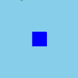

+++
date = "2019-08-17T20:55:06+09:00"
draft = false
slug = ""
tags = ["collision"]
title = "【phina.js】当たり判定について考える"
eyecatch = "mycollision.gif"
+++



## はじめに
ゲーム作りにおいて、当たり判定ほど奥深く悩まされるものはないと言ってよいでしょう。   
今回は、**phina.js**における当たり判定のアプローチについての自分なりの考察です。

## hitTestElementを使う
- **phina.app.Object2d**を継承したクラスであれば、**hitTestElement**を使えば手軽に当たり判定ができます。
- 矩形同士での判定になりますので、一番手軽です。一方で、グラフィックが矩形より小さいと大雑把な判定になってしまうという欠点があります。

> 参考記事   
> [[phina.js-Tips-41] 当たり判定を行う（矩形判定）](https://qiita.com/alkn203/items/2e567ee47a4a1a8b8ee4)

## Collisionを自前で用意する
- [	【phina.js】2Dシューティングチュートリアル =第6回 当たり判定とアニメーションイベントとグループ=](https://alkn203.github.io/blog/posts/tutorials/phina-shooting-06/)で自前で作ったような**Collision**クラスを使う方法です。
- 任意の位置やサイズに設定することができるので柔軟性があります。一方で、絶対座標と相対座標の関係に気を付けないと、正しい当たり判定ができないという欠点があります。

> 参考記事   
> [[phina.js]Colliderアクセサリを作ってみた話](https://qiita.com/alkn203/items/8c24d433e9eb8ea0f4bc)

## 当たり判定用のShapeを親にしてスプライトなどを子として追加する
- **RectangleShape**や**CircleShape**を当たり判定の対象として、スプライトをその子要素として追加する方法です。
- 絶対座標で当たり判定ができるというメリットがあります。
- **Shape**を**hide**メソッドで隠すと子要素まで隠れてしまいますので、**Shape**のコンストラクタで**fill**と**stroke**を透明にすると見えないようにすることができます。

## サンプルコード

[当たり判定を行う（当たり判定用矩形にスプライト追加）(runstant)](https://runstant.com/alkn203/projects/e0239f85)

```javascript

// グローバルに展開
phina.globalize();
// アセット
var ASSETS = {
  // 画像
  image: {
    'tomapiko': 'https://cdn.jsdelivr.net/gh/phinajs/phina.js@develop/assets/images/tomapiko.png',
  },
};
/*
 * メインシーン
 */
phina.define("MainScene", {
  // 継承
  superClass: 'DisplayScene',
  // コンストラクタ
  init: function() {
    // 親クラス初期化
    this.superInit();
    // 背景
    this.backgroundColor = 'skyblue';
    // 判定対象
    var shape = Shape({
      backgroundColor: 'blue',
      x: this.gridX.center(),
      y: this.gridY.center(),
      width: 100,
      height: 100,
    }).addChildTo(this);
    // 当たり判定用の矩形
    var rect = RectangleShape({
      width: 40,
      height: 54,
      fill: null,
      stroke: null,
    }).addChildTo(this);

    rect.x = this.gridX.span(1);
    rect.y = this.gridY.span(1);
    // スプライトを子要素として追加
    Sprite('tomapiko').addChildTo(rect);
    // タッチイベント
    this.onpointmove = function(e) {
      // スプライトをタッチ位置に
      rect.x = e.pointer.x;
      rect.y = e.pointer.y;
    };
    // 更新処理
    this.update = function() {
      // 矩形判定
      if (rect.hitTestElement(shape)) {
        shape.backgroundColor = 'red';
      }
      else {
        shape.backgroundColor = 'blue';
      }
    };
  },
});
/*
 * メイン処理
 */
phina.main(function() {
  // アプリケーションを生成
  var app = GameApp({
    // MainScene から開始
    startLabel: 'main',
    // アセット読み込み
    assets: ASSETS,
  });
  // fps表示
  //app.enableStats();
  // 実行
  app.run();
});

```
