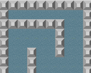

+++
date = "2020-02-25T20:55:06+09:00"
draft = false
slug = ""
title = "【phina.js】塗りつぶしアルゴリズムとtweenerを組み合わせた表現"
eyecatch = "fill.png"
+++

## はじめに

ふと思い立って、単純な塗りつぶしアルゴリズムと**tweener**を組み合わせて、塗りつぶしが進む様子を可視化してみました。

上手く使うとゲームで室内が水で埋まっていく表現とかに使えそうです。



[runstantで実行](https://runstant.com/alkn203/projects/6f782143)
 
## コーディングにおけるポイント

- 塗りつぶしアルゴリズムは一番単純なもので、塗りつぶし開始地点から上下左右のタイルで塗りつぶし可能なものを調べて、それを再帰的に調べて処理していくというものです。
- 探査の途中で時間差で水を表示するとタイムラグが生じるため、一旦水を配置したら非表示にしています。
- **tweener**の**wait**を使って、時間差で水を再表示していくようにしています。

## ソースコード

```javascript
// グローバルに展開
phina.globalize();
// アセット
var ASSETS = {
  // 画像
  image: {
    'tile': 'https://cdn.jsdelivr.net/gh/alkn203/tomapiko_run@master/assets/tile.png',
    'tile_sea': 'https://cdn.jsdelivr.net/gh/alkn203/assets_etc@master/pipo-map001_at-umi.png',
  },
};
// 定数
var UNIT = 64;
/*
 * メインシーン
 */
phina.define("MainScene", {
  // 継承
  superClass: 'DisplayScene',
  // コンストラクタ
  init: function() {
    // 親クラス初期化
    this.superInit();
    
    var data = [
      [2,2,2,2,2,2,2,2,2,2],
      [2,1,1,1,1,1,1,1,1,2],
      [2,2,2,2,2,2,2,1,1,2],
      [2,1,1,1,1,1,2,1,1,2],
      [2,1,1,1,1,1,2,1,1,2],
      [2,1,1,2,1,1,2,1,1,2],
      [2,1,1,2,1,1,1,1,1,2],
      [2,1,1,2,1,1,1,1,1,2],
      [2,1,1,2,1,1,1,1,1,2],
      [2,1,1,2,1,1,1,2,2,2],
      [2,1,1,1,1,1,1,1,1,2],
      [2,1,1,1,1,2,1,1,1,2],
      [2,1,2,2,2,2,2,1,1,2],
      [2,1,1,1,1,1,1,1,1,2],
      [2,2,2,2,2,2,2,2,2,2]
    ];
    
    var col = [
      [1,1,1,1,1,1,1,1,1,1],
      [1,0,0,0,0,0,0,0,0,1],
      [1,1,1,1,1,1,1,0,0,1],
      [1,0,0,0,0,0,1,0,0,1],
      [1,0,0,0,0,0,1,0,0,1],
      [1,0,0,1,0,0,1,0,0,1],
      [1,0,0,1,0,0,0,0,0,1],
      [1,0,0,1,0,0,0,0,0,1],
      [1,0,0,1,0,0,0,0,0,1],
      [1,0,0,1,0,0,0,1,1,1],
      [1,0,0,0,0,0,0,0,0,1],
      [1,0,0,0,0,1,0,0,0,1],
      [1,0,1,1,1,1,1,0,0,1],
      [1,0,0,0,0,0,0,0,0,1],
      [1,1,1,1,1,1,1,1,1,1]
    ];

    this.map = phina.util.Map({
      tileWidth: UNIT,
      tileHeight: UNIT,
      imageName: 'tile',
      mapData: data,
      collisionData: col,
    }).addChildTo(this);
    
    this.waterGroup = DisplayElement().addChildTo(this);
    
    this.fill(1, 1);
    this.showWater();
  },
  // 水表示
  showWater: function() {
    this.waterGroup.children.each(function(water, i) {
      // 時間差で表示
      water.tweener.wait(100 * i)
                   .call(function() {
                     water.show();
                   }).play();
    });
  },
  // 塗りつぶし
  fill: function(i, j) {
    var map = this.map;
    var arr = [[1, 0], [-1, 0], [0, 1], [0, -1]];
    var self = this;
    // タイル情報更新
    map.setTile(i, j, -1);
    // 指定したインデックスの子要素を得る
    var target = this.map.getChildByIndex(i, j);
    // 水スプライト・一旦非表示
    var sea = Sprite('tile_sea', 32, 32).addChildTo(this.waterGroup).setPosition(target.x, target.y);
    sea.setFrameIndex(4).hide();
    sea.setSize(64, 64);
    // 上下左右隣のタイルを調べる
    arr.each(function(elem) {
      var di = i + elem[0];
      var dj = j + elem[1];
      // 塗りつぶせる場所があれば
      if (map.checkTileByIndex(di, dj) === 1) {
        // 再起呼び出し
        self.fill(di, dj);
      }
    });
  },
});
/*
 * メイン処理
 */
phina.main(function() {
  // アプリケーションを生成
  var app = GameApp({
    // MainScene から開始
    startLabel: 'main',
    // アセット読み込み
    assets: ASSETS,
  });
  // fps表示
  //app.enableStats();
  // 実行
  app.run();
});
```
