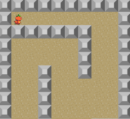

+++
date = "2020-01-03T20:55:06+09:00"
draft = false
slug = ""
tags = ["extension","map"]
title = "【phina.js】Mapクラスを作ってみた"
eyecatch = "map.png"
+++

## はじめに
**RPG**などで固定マップで単純な当たり判定を行いたい時は、**Map**データと当たり判定データを読み込んで行う方法が便利です。
今回は、**enchant.js**にあった**Map**クラスを参考に**phina.js**版を作ってみました。



## コンストラクタ

```javascript
var map = phina.util.Map({
  tileWidth: 64,
  tileHeight: 64,
  imageName: 'tile',
  mapData: data,
  collisionData: collision,
}).addChildTo(this);
```

| プロパティ     | 説明     |
| :------------- | :------------- |
| tileWidth       | タイルの幅       |
| tileHeight       | タイルの高さ       |
| imageName        | タイルセット画像の名前  |
| mapData          | マップデータの2次元配列  |
| collisionData    | タイル衝突判定用の2次元配列 |


## メンバ関数

| 関数     | 説明     |
| :------------- | :------------- |
| hitTest       | マップとの衝突判定を行う       |
| checkTile       | タイルが何か調べる       |

## おわりに
本格的なマップ作成には、タイルマップエディタが必要になってくると思いますが、簡単なゲームであれば、この程度の機能でも使えるのではないでしょうか。   

* [サンプルコード(runstant)](https://runstant.com/alkn203/projects/05d8a818)
* [ソースコード(Github)](https://github.com/alkn203/phina-extensions/blob/master/util/map.js) 