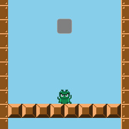

+++
date = "2019-08-24T20:55:06+09:00"
draft = false
slug = ""
tags = ["origin",]
title = "【phina.js】マリオのような敵を踏みつぶすエフェクト"
eyecatch = "stump.gif"
+++

## はじめに
マリオシリーズが代表するように、敵を上から踏みつけた時に敵が潰れるエフェクトはアクションゲームではもはや定番になっています。
今回は、敵が潰れるエフェクトを**phina.js**で表現してみます。



[サンプルコード(runstant)](https://runstant.com/alkn203/projects/b748b651)

## オブジェクトのoriginを理解する
* 今回の目的を実現するためには、オブジェクトの**origin**の変更を行う必要があります。
* **phina.js**のオブジェクトには**origin**というプロパティがあり、位置指定、回転、拡大縮小の時の基準となっています。
* **Vector2**クラス形式となっており、デフォルトは**(0.5, 0.5）**でオブジェクトの中心になっています。
  


## 敵が潰れるエフェクト
* 敵が潰れるアニメーションは、**tweener**を用います。
* **ScaleY**の値を変化させて縦に縮小させます。

```javascript
// 縦方向に縮小
bugbow.tweener.clear().to({scaleY: 0.1}, 200);
```

* 期待する結果としては下方向に潰れて欲しいところですが、今のままだと中心に向かって縮小され、思い通りの結果になりません。
* これは**origin**がオブジェクトの中心になっているのが原因です。

## originの変更と位置の調整

* 下に縮小するようにするためには、**origin**を**(0.5, 1.0)**に変更します。
* 変更した**origin**がオブジェクトの位置の基準となるため、変更した**origin**の分だけ上にずらして位置調整します。

```javascript
// origin変更
bugbow.setOrigin(0.5, 1.0);
// 位置調整
bugbow.y += bugbow.height / 2;
// 縦方向に縮小
bugbow.tweener.clear().to({scaleY: 0.1}, 200);
```

## おわりに
実際には、敵が潰れたコマ画像を用意してフレームを切り替えた方が効率的かもしれません。今回の内容は、あくまでも１つのアプローチと考えてもらえればと思います。
