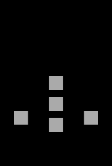

+++
date = "2021-06-13T20:55:06+09:00"
draft = false
slug = ""
tags = ["shape"]
title = "Shapeの位置を指定する"
eyecatch = "locate-shape.png"
+++



## Shapeの位置指定
**Shape**の位置指定には複数の方法があります。

####  x,yプロパティに直接指定
```js
// Shapeを作成してシーンに追加
var shape = Shape().addChildTo(this);
// 位置指定
shape.x = 320;
shape.y = 480;
```

#### setPosition関数で一括指定
**setPosition** 関数を使えば、 **x, y** の値を一括で指定することができ、生成から一気にチェインメソッドで繋げて書くこともできるので便利です。

```js
var shape = Shape().addChildTo(this).setPosition(320, 480);
```

#### **Shape**のコンストラクタで指定
```js
var shape = Shape({
  x: 320,
  y: 480
}).addChildTo(this)
```

#### 移動量で指定
**moveBy**関数を使えば、**x, y**の移動量で位置を変更することができます。

```js
shape.setPosition(320, 480).moveBy(100, 200);
```

#### ベクトル値の加算で指定
**Vector2**クラスを使ってベクトル値の加算で位置指定する方法もあります。

```js
var v = Vector2(100, 200);
shape.position.add(v);
```

## サンプルコード
```js
// グローバルに展開
phina.globalize();
/*
 * メインシーン
 */
phina.define("MainScene", {
  // 継承
  superClass: 'DisplayScene',
  // 初期化
  init: function() {
    // 親クラス初期化
    this.superInit();
    // 背景色
    this.backgroundColor = 'black';
    // Shapeを作成してシーンに追加
    var shape = Shape().addChildTo(this);
    // 位置指定
    shape.x = 320;
    shape.y = 480;
    // setPosition
    var shape2 = Shape().addChildTo(this).setPosition(320, 600);
    // コンストラクタ
    var shape3 = Shape({
      x: 320,
      y: 720,
    }).addChildTo(this);
    // moveBy
    var shape4 = Shape().addChildTo(this).setPosition(320, 480).moveBy(200, 200);
    // ベクトル
    var shape5 = Shape().addChildTo(this).setPosition(320, 480);
    var v = Vector2(-200, 200);  
    shape5.position.add(v);
  },
});
/*
 * メイン処理
 */
phina.main(function() {
  // アプリケーションを生成
  var app = GameApp({
    // MainScene から開始
    startLabel: 'main',
  });
  // fps表示
  //app.enableStats();
  // 実行
  app.run();
});
```

## runstantプロジェクト
