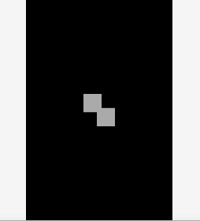

+++
date = "2021-06-18T21:55:06+09:00"
draft = false
slug = ""
tags = ["shape"]
title = "Shapeを移動させる"
eyecatch = "move-shape.gif"
+++



## Shapeの移動
**Shape** を始めとしたオブジェクトの移動は、オブジェクトの**update**関数で位置を変更させるのが一般的です。

## update関数で位置を変更する
**update** 関数は毎フレーム呼ばれるので、関数内で以下のように記述することで **Shape** を移動させることができます。

```js
// 移動
shape.update = function() {
  shape.x += 2;  
  shape.y += 2;
};
```

## moveBy関数を使った移動
オブジェクトに用意されている**moveBy**関数を使って移動させることもできます。

```js
// 移動
shape.update = function() {
  shape.moveBy(-2, -2);
};
```
## サンプルコード
<details>
<summary>コードを見る</summary>

```js
// グローバルに展開
phina.globalize();
/*
 * メインシーン
 */
phina.define("MainScene", {
  // 継承
  superClass: 'DisplayScene',
  // 初期化
  init: function() {
    // 親クラス初期化
    this.superInit();
    // 背景色
    this.backgroundColor = 'black';
    // Shapeを作成してシーンに追加
    var shape = Shape().addChildTo(this).setPosition(320, 480);
    // 移動
    shape.update = function() {
      shape.x += 2;  
      shape.y += 2;
    };
    // Shapeを作成してシーンに追加
    var shape2 = Shape().addChildTo(this).setPosition(320, 480);
    // 移動
    shape2.update = function() {
      shape2.moveBy(-2, -2);
    };
  },
});
/*
 * メイン処理
 */
phina.main(function() {
  // アプリケーションを生成
  var app = GameApp({
    // MainScene から開始
    startLabel: 'main',
  });
  // fps表示
  //app.enableStats();
  // 実行
  app.run();
});
```

</details>

## runstantプロジェクト
