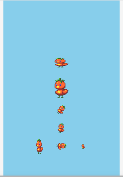

+++
date = "2021-06-19T10:55:06+09:00"
draft = false
slug = ""
tags = ["sprite"]
title = "Spriteを回転させる"
eyecatch = "rotate-sprite.gif"
+++



**Sprite** は、**Shape** と同じ基底クラスを継承していますので、共通のプロパティやメソッドを使用することができます。

## Spriteの回転

```js
// 回転
var sp2 = Sprite('tomapiko').addChildTo(this).setPosition(320, 600);
sp2.rotation = 45;
// setRotation
Sprite('tomapiko').addChildTo(this).setPosition(320, 700).setRotation(15);
// 回転アニメーション
sp3 = Sprite('tomapiko').addChildTo(this).setPosition(320, 800);
sp3.update = function() {
  sp3.rotation++;
};
```

## サンプルコード
<details>
<summary>コードを見る</summary>

```js
// グローバルに展開
phina.globalize();
// アセット
var ASSETS = {
  // 画像
  image: {
    'tomapiko': 'https://cdn.jsdelivr.net/gh/phinajs/phina.js@develop/assets/images/tomapiko.png',
  },
};
/*
 * メインシーン
 */
phina.define("MainScene", {
  // 継承
  superClass: 'DisplayScene',
  // 初期化
  init: function() {
    // 親クラス初期化
    this.superInit();
    // 背景色
    this.backgroundColor = 'skyblue';
    // 回転
    var sp2 = Sprite('tomapiko').addChildTo(this).setPosition(320, 600);
    sp2.rotation = 45;
    Sprite('tomapiko').addChildTo(this).setPosition(320, 700).setRotation(15);
    // 回転アニメーション
    sp3 = Sprite('tomapiko').addChildTo(this).setPosition(320, 800);
    sp3.update = function() {
      sp3.rotation++;
    };
  },
});
/*
 * メイン処理
 */
phina.main(function() {
  // アプリケーションを生成
  var app = GameApp({
    // MainScene から開始
    startLabel: 'main',
    // アセット読み込み
    assets: ASSETS,
  });
  // fps表示
  //app.enableStats();
  // 実行
  app.run();
});
```

</details>

## runstantプロジェクト
https://runstant.com/alkn203/projects/a1919f6a