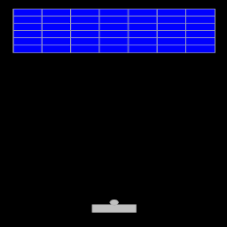

+++
date = "2020-09-20T20:55:06+09:00"
draft = false
slug = ""
tags = ["breakout"]
title = "【phina.js】ゲーム作成チュートリアル（ブロック崩し）=第3回 ボールの作成="
eyecatch = "breakout03.png"
+++

## はじめに
前回は、プレイヤーが操作する**パドル**を作成しました。今回は、ブロック崩しの肝とも言える**ボール**を作成したいと思います。



[runstantで確認](http://runstant.com/alkn203/projects/0d1fb8d6)

コードは以下のとおりです。

```js
// グローバルに展開
phina.globalize();
/*
 * 定数
 */
var BLOCK_WIDTH = 40 * 2;
var BLOCK_HEIGHT = 60 / 2;
var PADDLE_WIDTH = BLOCK_WIDTH * 1.5;
var PADDLE_HEIGHT = BLOCK_HEIGHT;
var BALL_RADIUS = BLOCK_WIDTH / 8;
/*
 * メインシーン
 */
phina.define("MainScene", {
  // 継承
  superClass: 'DisplayScene',
  // コンストラクタ
  init: function() {
    // 親クラス初期化
    this.superInit();
    // 背景色
    this.backgroundColor = 'black';
    // ブロックグループ
    this.blockGroup = DisplayElement().addChildTo(this);
    // 位置判定用のRect
    var screenRect = Rect(0, 0, 640, 960);

    var self = this;
    // Gridを利用してブロック設置
    Array.range(2, 16, 2).each(function(spanX) {
      Array.range(1, 4, 0.5).each(function(spanY) {
        Block().addChildTo(self.blockGroup)
               .setPosition(self.gridX.span(spanX), self.gridY.span(spanY));
      });
    });
    // パドル移動ライン
    var paddleY = this.gridY.span(14.5);
    // パドル設置
    var paddle = Paddle().addChildTo(this)
                         .setPosition(this.gridX.center(), paddleY);
    // 画面上でのタッチ移動時
    this.onpointmove = function(e) {
      // タッチ位置に移動
      paddle.setPosition(e.pointer.x | 0, paddleY);
      // 画面はみ出し防止
      if (paddle.left < screenRect.left) { paddle.left = screenRect.left; }
      if (paddle.right > screenRect.right) { paddle.right = screenRect.right; }
    };
    // ボール作成
    this.ball = Ball().addChildTo(this);
    // シーン全体から参照可能にする
    this.paddle = paddle;
  },
  // 毎フレーム更新
  update: function() {
    var ball = this.ball;
    var paddle = this.paddle;
    // ボールはパドルの真上
    ball.x = paddle.x;
    ball.bottom = paddle.top;
  },
});
/*
 * ブロッククラス
 */
phina.define('Block', {
  // 親クラス指定
  superClass: 'RectangleShape',
  // コンストラクタ
  init: function() {
    // 親クラス初期化
    this.superInit({
      width: BLOCK_WIDTH,
      height: BLOCK_HEIGHT,
    });
  },
});
/*
 * パドルクラス
 */
phina.define('Paddle', {
  // 親クラス指定
  superClass: 'RectangleShape',
  // コンストラクタ
  init: function() {
    // 親クラス初期化
    this.superInit({
      width: PADDLE_WIDTH,
      height: PADDLE_HEIGHT,
      fill: 'silver',
    });
  },
});
/*
 * ボールクラス
 */
phina.define('Ball', {
  // 親クラス指定
  superClass: 'CircleShape',
  // コンストラクタ
  init: function() {
    // 親クラス初期化
    this.superInit({
      radius: BALL_RADIUS,
      fill: 'silver',
    });
  },
});
/*
 * メイン処理
 */
phina.main(function() {
  // アプリケーションを生成
  var app = GameApp({
    title: 'Break Out',
  });
  // 実行
  app.run();
});
```

## 定数
```js
var BALL_RADIUS = BLOCK_WIDTH / 8;
```
* ボールの半径をブロックの幅の1/8のサイズにしています。つまり、直径がブロックの幅の1/4の円とします。

## ボールクラス
```js
phina.define('Ball', {
  // 親クラス指定
  superClass: 'CircleShape',
  // コンストラクタ
  init: function() {
    // 親クラス初期化
    this.superInit({
      radius: BALL_RADIUS,
      fill: 'silver',
    });
  },
});
```

* **phina.define**で**Ball**クラスを定義しています。
* ボールは円なので**CircleShape**クラスを継承し、**superInit**で親クラスへパラメータを渡しています。**radius**は円の半径サイズです。

## ボールの追加
```js
    // ボール作成
    this.ball = Ball().addChildTo(this);
    // シーン全体から参照可能にする
    this.paddle = paddle;
```

* ボールを作成して**MainScene**に追加しています。位置は別で設定するので、今回はシーンへの追加のみです。
* 現在の**paddle**変数は、**init**関数内だけのスコープとなっているので、**MainScene**全体から参照できるように**this.paddle**に代入しています。

## フレーム処理
```js
  // 毎フレーム更新
  update: function() {
    var ball = this.ball;
    var paddle = this.paddle;
    // ボールはパドルの真上
    ball.x = paddle.x;
    ball.bottom = paddle.top;
  },
```

* **update**関数には、毎フレーム行う処理を記載します。
* ボールをパドルの真上になるように設置します。
* 毎フレーム呼ばれるので、パドルを移動してもボールが追従するようになります。

## ボールの発射、パドルおよび壁との反射処理

このままだと、ボールがパドルについたままですので、ボールの発射と反射処理を追加します。コードは以下のとおりです。

```js
// グローバルに展開
phina.globalize();
/*
 * 定数
 */
var BLOCK_WIDTH = 40 * 2;
var BLOCK_HEIGHT = 60 / 2;
var PADDLE_WIDTH = BLOCK_WIDTH * 1.5;
var PADDLE_HEIGHT = BLOCK_HEIGHT;
var BALL_RADIUS = BLOCK_WIDTH / 8;
/*
 * メインシーン
 */
phina.define("MainScene", {
  // 継承
  superClass: 'DisplayScene',
  // コンストラクタ
  init: function() {
    // 親クラス初期化
    this.superInit();
    // 背景色
    this.backgroundColor = 'black';
    // ブロックグループ
    this.blockGroup = DisplayElement().addChildTo(this);
    // 位置判定用のRect
    var screenRect = Rect(0, 0, 640, 960);

    var self = this;
    // Gridを利用してブロック設置
    Array.range(2, 16, 2).each(function(spanX) {
      Array.range(1, 4, 0.5).each(function(spanY) {
        Block().addChildTo(self.blockGroup)
               .setPosition(self.gridX.span(spanX), self.gridY.span(spanY));
      });
    });
    // パドル移動ライン
    var paddleY = this.gridY.span(14.5);
    // パドル設置
    var paddle = Paddle().addChildTo(this)
                         .setPosition(this.gridX.center(), paddleY);
    // 画面上でのタッチ移動時
    this.onpointmove = function(e) {
      // タッチ位置に移動
      paddle.setPosition(e.pointer.x | 0, paddleY);
      // 画面はみ出し防止
      if (paddle.left < screenRect.left) { paddle.left = screenRect.left; }
      if (paddle.right > screenRect.right) { paddle.right = screenRect.right; }
    };
    // 画面上でタッチが離れた時
    this.onpointend = function() {
      if (self.status === 'ready') {
        // ボール発射
        self.ball.vy = -self.ball.speed;
        self.status = 'move';
      }
    };
    // ボール作成
    this.ball = Ball().addChildTo(this);
    // シーン全体から参照可能にする
    this.paddle = paddle;
    this.screenRect = screenRect;
    // ゲーム状態
    this.status = 'ready';
  },
  // 毎フレーム更新
  update: function() {
    var ball = this.ball;
    var paddle = this.paddle;
    var screenRect = this.screenRect;
    // ボール待機中
    if (this.status === 'ready') {
      // ボールはパドルの真上
      ball.vx = ball.vy = 0;
      ball.x = paddle.x;
      ball.bottom = paddle.top;
    }
    // ボール移動中
    if (this.status === 'move') {
      // ボール移動
      ball.moveBy(ball.vx, ball.vy);
      // 画面端反射
      // 上
      if (ball.top < screenRect.top) {
        ball.top = screenRect.top;
        ball.vy = -ball.vy;
      }
      // 左
      if (ball.left < screenRect.left) {
        ball.left = screenRect.left;
        ball.vx = -ball.vx;
      }
      // 右
      if (ball.right > screenRect.right) {
        ball.right = screenRect.right;
        ball.vx = -ball.vx;
      }
      // 落下
      if (ball.top > screenRect.bottom) {
        // 準備状態へ
        this.status = 'ready';
      }
      // パドルとの反射
      if (ball.hitTestElement(paddle) && ball.vy > 0) {
        ball.bottom = paddle.top;
        ball.vy = -ball.vy;
        // 当たった位置で角度を変化させる
        var dx = paddle.x - ball.x;
        ball.vx = -dx / 5;
      }
    }
  },
});
/*
 * ブロッククラス
 */
phina.define('Block', {
  // 親クラス指定
  superClass: 'RectangleShape',
  // コンストラクタ
  init: function() {
    // 親クラス初期化
    this.superInit({
      width: BLOCK_WIDTH,
      height: BLOCK_HEIGHT,
    });
  },
});
/*
 * パドルクラス
 */
phina.define('Paddle', {
  // 親クラス指定
  superClass: 'RectangleShape',
  // コンストラクタ
  init: function() {
    // 親クラス初期化
    this.superInit({
      width: PADDLE_WIDTH,
      height: PADDLE_HEIGHT,
      fill: 'silver',
    });
  },
});
/*
 * ボールクラス
 */
phina.define('Ball', {
  // 親クラス指定
  superClass: 'CircleShape',
  // コンストラクタ
  init: function() {
    // 親クラス初期化
    this.superInit({
      radius: BALL_RADIUS,
      fill: 'silver',
    });
    // スピード
    this.speed = 6;
  },
});
/*
 * メイン処理
 */
phina.main(function() {
  // アプリケーションを生成
  var app = GameApp({
    title: 'Break Out',
  });
  // fps変更
  app.fps = 60;
  // 実行
  app.run();
});
```
<a href="http://runstant.com/alkn203/projects/9bf709b3" target="_blank">[runstantで確認]</a>

## ボールのスピード
```js
    // スピード
    this.speed = 6;
```

* **Ball**クラスにボールのスピードのプロパティを追加します。

## ゲームステータス
```js
    // ゲーム状態
    this.status = 'ready';
```

* ボールの状態管理のための変数を追加します。**ready**は、パドルの上で待機中の状態とします。

## ボールの発射
```js
    // 画面上でタッチが離れた時
    this.onpointend = function() {
      if (self.status === 'ready') {
        // ボール発射
        self.ball.vy = -self.ball.speed;
        self.status = 'move';
      }
    };
```
* ボールはタッチを離した時に発射させたいので、**pointend**イベントを拾う**this.onpointend**関数内に処理を書きます。
* ボールの状態が**ready**の場合に、**ball.vy**として、スピードを元にした画面上方向の移動量を設定します。
* ボール発射後は、状態を**move**としています。

## ボールの状態で処理を分ける
```js
    // ボール待機中
    if (this.status === 'ready') {
      // ボールはパドルの真上
      ball.vx = ball.vy = 0;
      ball.x = paddle.x;
      ball.bottom = paddle.top;
    }
    // ボール移動中
    if (this.status === 'move') {
      // ボール移動
      ball.moveBy(ball.vx, ball.vy);
```

* **update**関数内の処理をボールの状態で分けます。
* 移動中の場合は、**moveBy**関数でx方向、y方向の移動量を元に移動処理を行います。ゲーム作りにおいてよく使われる手法です。

## 壁との発射処理
```js
      // 画面端反射
      // 上
      if (ball.top < screenRect.top) {
        ball.top = screenRect.top;
        ball.vy = -ball.vy;
      }
      // 左
      if (ball.left < screenRect.left) {
        ball.left = screenRect.left;
        ball.vx = -ball.vx;
      }
      // 右
      if (ball.right > screenRect.right) {
        ball.right = screenRect.right;
        ball.vx = -ball.vx;
      }
      // 落下
      if (ball.top > screenRect.bottom) {
        // 準備状態へ
        this.status = 'ready';
      }
```

* 画面上と左右を壁とみなして、反射処理を行います。
* 上の場合は**vy**を反転、左右の場合は、**vx**を反転させています。
* 反射をきれいに見せるために、ボール位置の補正をしています。
* 画面下の場合は落下とみなして、ボールを初期状態に戻しています。

## パドルとの発射処理
```js
      // パドルとの反射
      if (ball.hitTestElement(paddle) && ball.vy > 0) {
        ball.bottom = paddle.top;
        ball.vy = -ball.vy;
        // 当たった位置で角度を変化させる
        var dx = paddle.x - ball.x;
        ball.vx = -dx / 5;
      }
    }
```

* **hitTestElement**でボールとパドルの当たり判定を行っています。
* 想定外の反射を防ぐために、ボールの移動方向が下向きであるかを併せてチェックしています。
* 初期設定のままだとボールが縦方向へ行ったり来たりしかしないので、パドルに当たった位置に応じて、角度を変化させています。

## 今回はここまで
ここまでで、ボールを発射してパドルで跳ね返すことができるようになりました。
次回は、ボールとブロックの反射を追加したいと思います。
