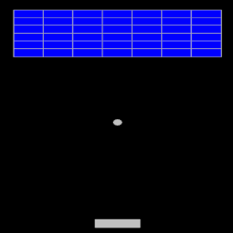

+++
date = "2020-09-30T20:55:06+09:00"
draft = false
slug = ""
tags = ["breakout"]
title = "【phina.js】ゲーム作成チュートリアル（ブロック崩し）=第4回 ボールとブロックの反射="
eyecatch = "breakout04.png"
+++

## はじめに

前回は、ボールと画面端、ボールとパドルの反射処理を実装しました。今回は、ボールとブロックの反射処理、そしてブロックの消去処理を追加したいと思います。



[runstantで確認](http://runstant.com/alkn203/projects/c686fe25)

## ボールとブロックの反射処理

ボールがブロックに当たると反射するようにします。まず、反射のパターンを整理したいと思います。
そこで、ボールとブロックとの当たり判定を以下のパターンに分けてみました。

* **ブロックの左上角** ・・・左上に跳ね返す
* **ブロックの右上角** ・・・右上に跳ね返す
* **ブロックの左下角** ・・・左下に跳ね返す
* **ブロックの右下角** ・・・右下に跳ね返す
* **ブロックの上面と下面** ・・・縦移動を反転させる
* **ブロックの左側面と右側面** ・・・横移動を反転させる

コードは以下のとおりです。

```js
// グローバルに展開
phina.globalize();
/*
 * 定数
 */
var BLOCK_WIDTH = 40 * 2;
var BLOCK_HEIGHT = 60 / 2;
var PADDLE_WIDTH = BLOCK_WIDTH * 1.5;
var PADDLE_HEIGHT = BLOCK_HEIGHT;
var BALL_RADIUS = BLOCK_WIDTH / 8;
/*
 * メインシーン
 */
phina.define("MainScene", {
  // 継承
  superClass: 'DisplayScene',
  // コンストラクタ
  init: function() {
    // 親クラス初期化
    this.superInit();
    // 背景色
    this.backgroundColor = 'black';
    // ブロックグループ
    this.blockGroup = DisplayElement().addChildTo(this);
    // 位置判定用のRect
    var screenRect = Rect(0, 0, 640, 960);

    var self = this;
    // Gridを利用してブロック設置
    Array.range(2, 16, 2).each(function(spanX) {
      Array.range(1, 4, 0.5).each(function(spanY) {
        Block().addChildTo(self.blockGroup)
               .setPosition(self.gridX.span(spanX), self.gridY.span(spanY));
      });
    });
    // パドル移動ライン
    var paddleY = this.gridY.span(14.5);
    // パドル設置
    var paddle = Paddle().addChildTo(this)
                         .setPosition(this.gridX.center(), paddleY);
    // 画面上でのタッチ移動時
    this.onpointmove = function(e) {
      // タッチ位置に移動
      paddle.setPosition(e.pointer.x | 0, paddleY);
      // 画面はみ出し防止
      if (paddle.left < screenRect.left) { paddle.left = screenRect.left; }
      if (paddle.right > screenRect.right) { paddle.right = screenRect.right; }
    };
    // 画面上でタッチが離れた時
    this.onpointend = function() {
      if (self.status === 'ready') {
        // ボール発射
        self.ball.vy = -self.ball.speed;
        self.status = 'move';
      }
    };
    // ボール作成
    this.ball = Ball().addChildTo(this);
    // シーン全体から参照可能にする
    this.paddle = paddle;
    this.screenRect = screenRect;
    // ゲーム状態
    this.status = 'ready';
  },
  // 毎フレーム更新
  update: function() {
    var ball = this.ball;
    var paddle = this.paddle;
    var screenRect = this.screenRect;
    // ボール待機中
    if (this.status === 'ready') {
      // ボールはパドルの真上
      ball.vx = ball.vy = 0;
      ball.x = paddle.x;
      ball.bottom = paddle.top;
    }
    // ボール移動中
    if (this.status === 'move') {
      // ボール移動
      ball.moveBy(ball.vx, ball.vy);
      // 画面端反射
      // 上
      if (ball.top < screenRect.top) {
        ball.top = screenRect.top;
        ball.vy = -ball.vy;
      }
      // 左
      if (ball.left < screenRect.left) {
        ball.left = screenRect.left;
        ball.vx = -ball.vx;
      }
      // 右
      if (ball.right > screenRect.right) {
        ball.right = screenRect.right;
        ball.vx = -ball.vx;
      }
      // 落下
      if (ball.top > screenRect.bottom) {
        // 準備状態へ
        this.status = 'ready';
      }
      // パドルとの反射
      if (ball.hitTestElement(paddle) && ball.vy > 0) {
        ball.bottom = paddle.top;
        ball.vy = -ball.vy;
        // 当たった位置で角度を変化させる
        var dx = paddle.x - ball.x;
        ball.vx = -dx / 5;
      }
            // ブロックとの反射
      this.blockGroup.children.some(function(block) {
        // ヒットなら
        if (ball.hitTestElement(block)) {
          // 左上かど
          if (ball.top < block.top && ball.left < block.left) {
            // 位置補正
            ball.right = block.left;
            ball.bottom = block.top;
            // 移動方向設定
            ball.vx = -ball.speed;
            ball.vy = -ball.speed;
            return true;
          }
          // 右上かど
          if (block.top < ball.top && block.right < ball.right) {
            ball.left = block.right;
            ball.bottom = block.top;
            ball.vx = ball.speed;
            ball.vy = -ball.speed;
            return true;
          }
          // 左下かど
          if (block.bottom < ball.bottom && ball.left < block.left) {
            ball.right = block.left;
            ball.top = block.bottom;
            ball.vx = -ball.speed;
            ball.vy = ball.speed;
            return true;
          }
          // 右下かど
          if (block.bottom < ball.bottom && block.right < ball.right) {
            ball.left = block.right;
            ball.top = block.bottom;
            ball.vx = ball.speed;
            ball.vy = ball.speed;
            return true;
          }
          // 左側
          if (ball.left < block.left) {
            ball.right = block.left;
            ball.vx = -ball.vx;
            return true;
          }
          // 右側
          if (block.right < ball.right) {
            ball.left = block.right;
            ball.vx = -ball.vx;
            return true;
          }
          // 上側
          if (ball.top < block.top) {
            ball.bottom = block.top;
            ball.vy = -ball.vy;
            return true;
          }
          // 下側
          if (block.bottom < ball.bottom) {
            ball.top = block.bottom;
            ball.vy = -ball.vy;
            return true;
          }
        }
      });
    }
  },
});
/*
 * ブロッククラス
 */
phina.define('Block', {
  // 親クラス指定
  superClass: 'RectangleShape',
  // コンストラクタ
  init: function() {
    // 親クラス初期化
    this.superInit({
      width: BLOCK_WIDTH,
      height: BLOCK_HEIGHT,
    });
  },
});
/*
 * パドルクラス
 */
phina.define('Paddle', {
  // 親クラス指定
  superClass: 'RectangleShape',
  // コンストラクタ
  init: function() {
    // 親クラス初期化
    this.superInit({
      width: PADDLE_WIDTH,
      height: PADDLE_HEIGHT,
      fill: 'silver',
    });
  },
});
/*
 * ボールクラス
 */
phina.define('Ball', {
  // 親クラス指定
  superClass: 'CircleShape',
  // コンストラクタ
  init: function() {
    // 親クラス初期化
    this.superInit({
      radius: BALL_RADIUS,
      fill: 'silver',
    });
    // スピード
    this.speed = 6;
  },
});
/*
 * メイン処理
 */
phina.main(function() {
  // アプリケーションを生成
  var app = GameApp({
    title: 'Break Out',
  });
  // fps変更
  app.fps = 60;
  // 実行
  app.run();
});
```

## コード説明
当たり判定はボールの移動中常時行う必要があるので、**update**関数内に追加します。

## ブロックとの反射

```js
// ブロックとの反射
this.blockGroup.children.some(function(block) {
  // ヒットなら
  if (ball.hitTestElement(block)) {
```

**blockGroup**の子要素配列をループして、ボールとの当たり判定を行います。
**each**を使いたいところですが、現状**forEach**には**break**に当たる処理がないとのことですので、打開策として**some**関数を使って、当たりと判定されたらループを抜けるようにしています。
この手法については、[本記事](http://qiita.com/phi/items/f998763d2d52bdd57a7c)を参考にしています。

## 角のあたり判定

角の当たり判定については、左上角を例に説明します。

```js
// 左上かど
if (ball.top < block.top && ball.left < block.left) {
  // 位置補正
  ball.right = block.left;
  ball.bottom = block.top;
  // 移動方向設定
  ball.vx = -ball.speed;
  ball.vy = -ball.speed;
  return true;
}
```

左上角の場合は、ボールがブロックに当たっていて、**ボールの左側がブロックの左側より左、かつボールの上側がブロックの上側より上**という位置関係にある時です。
画面上で**vx**は負、**vy**も負の方向、つまり左斜め上45度方向に返します。

## 側面との当たり判定

```js
// 左側
if (ball.left < block.left) {
  ball.right = block.left;
  ball.vx = -ball.vx;
  return true;
}
// 右側
if (block.right < ball.right) {
  ball.left = block.right;
  ball.vx = -ball.vx;
  return true;
}
```
側面の場合は、**vy**はそのままで**vx**を反転させます。

## 上下面との当たり判定

```js
// 上側
if (ball.top < block.top) {
  ball.bottom = block.top;
  ball.vy = -ball.vy;
  return true;
}
// 下側
if (block.bottom < ball.bottom) {
  ball.top = block.bottom;
  ball.vy = -ball.vy;
  return true;
}
```

上下面の場合は、**vx**はそのままで**vy**を反転させます。

## ボールが当たったブロックを消去する

次はブロックの消去処理を追加します。
**update**関数内のボールとブロックの衝突処理部分を以下のとおり変更します。

```js
// ブロックとの反射
 this.blockGroup.children.some(function(block) {
   // ヒットなら
   if (ball.hitTestElement(block)) {
     // 左上かど
     if (ball.top < block.top && ball.left < block.left) {
       // 位置補正
       ball.right = block.left;
       ball.bottom = block.top;
       // 移動方向設定
       ball.vx = -ball.speed;
       ball.vy = -ball.speed;
       // ブロック消去
       block.remove();
       return true;
     }
     // 右上かど
     if (block.top < ball.top && block.right < ball.right) {
       ball.left = block.right;
       ball.bottom = block.top;
       ball.vx = ball.speed;
       ball.vy = -ball.speed;
       block.remove();
       return true;
     }
     // 左下かど
     if (block.bottom < ball.bottom && ball.left < block.left) {
       ball.right = block.left;
       ball.top = block.bottom;
       ball.vx = -ball.speed;
       ball.vy = ball.speed;
       block.remove();
       return true;
     }
     // 右下かど
     if (block.bottom < ball.bottom && block.right < ball.right) {
       ball.left = block.right;
       ball.top = block.bottom;
       ball.vx = ball.speed;
       ball.vy = ball.speed;
       block.remove();
       return true;
     }
     // 左側
     if (ball.left < block.left) {
       ball.right = block.left;
       ball.vx = -ball.vx;
       block.remove();
       return true;
     }
     // 右側
     if (block.right < ball.right) {
       ball.left = block.right;
       ball.vx = -ball.vx;
       block.remove();
       return true;
     }
     // 上側
     if (ball.top < block.top) {
       ball.bottom = block.top;
       ball.vy = -ball.vy;
       block.remove();
       return true;
     }
     // 下側
     if (block.bottom < ball.bottom) {
       ball.top = block.bottom;
       ball.vy = -ball.vy;
       block.remove();
       return true;
     }
   }
 });
 ```
[runstantで確認](http://runstant.com/alkn203/projects/efc751d8)
 
## 消去処理

```js
// ブロック消去
block.remove();
```

当たり判定で当たったブロックについて、**block.remove**として自身を消去しています。
この処理を各判定毎に行います。

## 補足
お気づきの方もいらっしゃるかもしれませんが、このままの処理だと当たり具合によって内部のブロックまで消去されることがあります。
これを防ぐためには、当たったブロックが一番外側にあるかどうかの判定を追加する必要があるかと思いますが、今回は割愛したいと思います。

## 今回はここまで

ここまでで、ボールを跳ね返してブロックが消去できるようになりました。
少しはブロック崩しらしくなってきたのではないかと思います。
次回は、**phina.js**の目玉機能の１つとも言える**Tweener**を使って、ブロックの消去アニメーションを行いと思います。