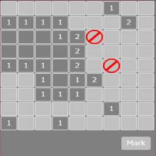

+++
date = "2020-10-17T20:56:06+09:00"
draft = false
slug = ""
tags = ["minesweeper"]
title = "【phina.js】ゲーム作成チュートリアル（マインスイーパー）=最終回 マーク機能の追加="
eyecatch = "minesweeper06.gif"
+++

## 今回の目標
前回ではゲームオーバーとクリア処理を追加しました。今回は最終回で、マーク機能を追加します。マーク機能とは、自分で爆弾と判断したパネルをマークして開けないようにする機能です。



[runstantで確認](http://runstant.com/alkn203/projects/a76987b1)

## マーク機能の追加
## MainSceneの変更点
```js
  // メインシーン
  phina.define('MainScene', {
    superClass: 'DisplayScene',
    // コンストラクタ
    init: function() {
      // 親クラス初期化
      （略）
      // ピース配置
      PANEL_NUM_XY.times(function(spanX) {
        PANEL_NUM_XY.times(function(spanY) {
          // パネル作成
          （略）
          // パネルタッチ時
          panel.onpointstart = function() {
            // マークモードなら
            if (self.mode === 'mark') {
              if (!panel.isOpen && !panel.isMark) {
                // マーク追加
                if (self.markCount < BOMB_NUM) {
                  Mark().addChildTo(panel);
                  panel.isMark = true;
                  self.markCount++;
                }
              }
              else {
                if (self.markCount > 0) {
                  // マーク削除
                  panel.children[0].remove();
                  panel.isMark = false;
                  self.markCount--;
                }
              }
            }
            else {
              // パネルを開く
              self.openPanel(panel);
              // クリア判定
              self.checkClear();
            }
          };
        });
      });
      // モード
      this.mode = 'normal';
```

* **this.mode**という変数でモードを管理します。
* マークモードであれば、パネルがタッチされた時にそのパネルがまだ開かれていなくて、かつ、マークされていなければマークを追加します。
* 逆にマークがあれば、マークを削除します。
* **this.markCount**という変数で、マーク数が爆弾の数を超えないようにしています。

```js
      // マークモードボタン
      Button({
        width: 120,
        height: 64,
        text: 'Mark',
        fill: 'silver',
      }).addChildTo(this)
        .setPosition(this.gridX.span(14), this.gridY.span(14.5))
        .onpush = function() {
          // モード変更
          if (self.mode === 'normal') {
            this.fill = 'hsl(160, 80%, 50%)';
            self.mode = 'mark';
          }
          else {
            this.fill = 'silver';
            self.mode = 'normal';
          }
        };
      // 参照用
      （略）
      // マークの数
      this.markCount = 0;
    },
```
  
* マークモードの切り替えには**Button**を使用します。
* **onpush** 関数にボタンを押したときの処理を記述します。
* 今回は現在のモードが分かるように切り替えでボタンの色が変わるようにしています。

```js
// パネルを開く処理
openPanel: function(panel) {
  // マークされていた何もしない
  if (panel.isMark) return;
  （略）
},
```

* マークされたパネルが連鎖で開かれないようにしています。

## おわりに
6回に渡ってチュートリアルを書いてきましたが、本エントリーが**phina.js**を使ったゲーム作りの参考になれば幸いです。