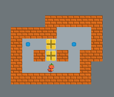

+++
date = "2020-03-08T20:55:06+09:00"
draft = false
slug = ""
tags = ["phina.js","game"]
title = "【phina.js】倉庫番風ゲームのプロトタイプを作ってみた"
eyecatch = "sokoban.png"
+++

## はじめに
**phina.js**で倉庫番風ゲームのプロトタイプを作ってみました。

[runstantで表示](http://runstant.com/alkn203/projects/6f369970)

## 作成にあたってのポイント
* 自作**Map**クラスの機能を活用してます。
* ステージデータはオブジェクト型の配列にしていますので、拡張すれば複数ステージ制にすることも可能かと思います。
* プレイヤーと荷物の移動は、**Tweener**を使うことで座標の移動に伴う座標のズレが発生しないようにしています。

## GitHubリポジトリ
https://github.com/alkn203/phina-games/tree/master/sokoban
